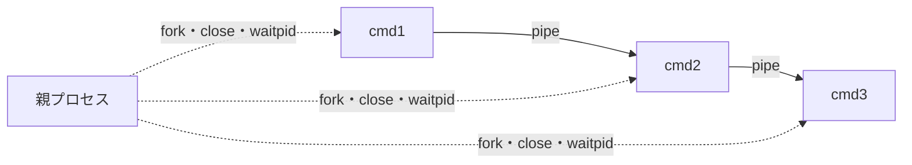

# minishell

`readline`、`fork`、`pipe`、`dup2`、`execve`などを使い、Bashの基本的な対話操作をCで再実装したプロジェクトです。

```bash
$ ./minishell
minishell$ echo "$USER" | wc -c > count.txt
minishell$ cat < count.txt
```

プロンプトから受け取った文字列を別のシェルへ渡すのではなく、字句解析、構文解析、展開、リダイレクト、プロセス生成、コマンド実行までをプログラム内で行います。

> A small interactive Unix shell written in C, with pipelines, redirections, environment expansion, built-ins, and signal handling.

## このプロジェクトについて

minishellは、フランス発のエンジニア養成機関「42」の課題です。シェルを利用する側ではなく実装する側に回り、入力されたコマンドがどのように解析され、プロセスやファイルディスクリプタへ変換されるのかを学びます。

この実装では、コマンドラインを次の段階に分けて処理します。


解析と実行を分離することで、クォート内のメタ文字と演算子を区別し、パイプラインやリダイレクトを構造として扱えるようにしています。

## 対応機能

- `readline`を使った対話プロンプトとコマンド履歴
- 外部コマンドの実行と`PATH`からの探索
- 複数コマンドのパイプライン（`|`）
- 入力、出力、追記、ヒアドキュメント（`<`、`>`、`>>`、`<<`）
- シングルクォートとダブルクォート
- 環境変数（`$USER`など）と直前の終了ステータス（`$?`）の展開
- `echo`、`cd`、`pwd`、`export`、`unset`、`env`、`exit`
- 対話中および子プロセス実行中の`Ctrl-C`、`Ctrl-D`、`Ctrl-\`の処理
- Bashに合わせた代表的な実行エラーと終了コード

## 実装でこだわった点

### 1. Lexer・Parser・Expander・Executorを分離する

シェルの入力は、単に空白で分割するだけでは扱えません。例えば次の入力では、クォート内の空白を保持しながら、クォート外の`|`だけをパイプとして認識する必要があります。

```bash
echo "hello world" | grep "hello"
```

Lexerは入力を`WORD`、`PIPE`、`INPUT`、`OUTPUT`、`HEREDOC`、`APPEND`へ分類します。Parserはトークン列からコマンドノードとパイプノードを持つAST（抽象構文木）を構築します。その後でExpanderがクォートの除去と変数展開を行い、ExecutorがASTをたどって実行します。

処理の責務を分けることで、「文字としての`|`」と「演算子としての`|`」を解析時の状態に応じて区別できます。

### 2. パイプラインをASTとして再帰的に実行する

`cmd1 | cmd2 | cmd3`は、左辺と右辺を持つパイプノードの組み合わせとして表現します。Executorは各パイプノードで`pipe`と`fork`を行い、左の標準出力をpipeの書き込み端へ、右の標準入力を読み取り端へ`dup2`します。



親子それぞれが不要になったpipe端を閉じ、読み手へEOFが届かず停止する問題を防ぎます。全プロセスを回収した後は、一般的なシェルと同様にパイプライン右端のコマンドの終了状態を採用します。

### 3. 状態を変更するビルトインを親プロセスで実行する

`cd`、`export`、`unset`、`exit`は、子プロセスだけで実行しても親シェルのカレントディレクトリや環境へ反映されません。そのため、単独のビルトインは親プロセスで実行します。

一方、パイプライン内のビルトインは外部コマンドと同様に子プロセス側で動作します。これにより、次の2つの意味の違いを保ちます。

```bash
cd /tmp          # minishell自身のカレントディレクトリが変わる
cd /tmp | pwd    # パイプ内の子プロセスだけが移動する
```

環境変数は連結リストで保持し、`export`と`unset`による変更後はコマンド探索に使う`PATH`も更新します。

### 4. クォート状態を保ちながら展開する

展開処理は、現在位置がシングルクォート内、ダブルクォート内、クォート外のどこかを管理しながら文字列を左から読みます。

| 入力 | 動作 |
| --- | --- |
| `'$USER'` | `$USER`を文字列として保持 |
| `"$USER"` | 値を展開し、1つの引数として保持 |
| `$USER` | 環境変数を展開 |
| `$?` | 直前のコマンドの終了ステータスを展開 |

クォートは実行時の引数から取り除きますが、クォートによって守られていた空白やメタ文字は同じ引数の一部として保持します。

### 5. 4種類のリダイレクトを同じリストで扱う

各コマンドノードには、入力された順序を保ったリダイレクトのリストを持たせています。Executorはリストを先頭から適用し、`open`と`dup2`で標準入出力を付け替えます。

| 記法 | 処理 |
| --- | --- |
| `< file` | ファイルを標準入力へ接続 |
| `> file` | ファイルを作成または上書きして標準出力へ接続 |
| `>> file` | ファイルを追記モードで開いて標準出力へ接続 |
| `<< LIMITER` | LIMITERまでの入力を標準入力へ接続 |

複数のリダイレクトがある場合も入力順に処理するため、後から指定したリダイレクトが最終的な接続先になります。

### 6. ヒアドキュメントを独立した子プロセスで読み取る

ヒアドキュメントは専用の子プロセスで入力を受け取り、`mkstemp`で作成した一時ファイルを標準入力へ接続します。一時ファイルは読み取り用に開いた直後に`unlink`し、通常終了後にファイル名を残しません。

```bash
cat << EOF | grep hello
hello world
goodbye
EOF
```

区切り文字がクォートされていない場合は本文中の環境変数を展開し、クォートされている場合は展開しません。また、入力中の`Ctrl-C`はヒアドキュメントだけを中断し、シェル本体へ終了ステータス`130`を伝えます。

### 7. 実行場所とエラー原因を区別する

コマンド名に`/`が含まれない場合は`PATH`の各ディレクトリを探索し、絶対パスまたは相対パスが指定された場合はそのパスを直接検査します。

コマンドが見つからない、対象がディレクトリ、実行権限がない、`PATH`が設定されていない、といったケースを分け、代表的なシェルの規則に合わせて終了コード`126`または`127`を返します。

```bash
minishell$ command_that_does_not_exist
minishell$ echo $?
127
```

### 8. シェルの状態に応じてシグナル処理を切り替える

同じ`Ctrl-C`でも、プロンプト入力中とコマンド実行中では期待される動作が異なります。

- プロンプト入力中の`Ctrl-C`は現在の入力を破棄して新しいプロンプトを表示
- プロンプト入力中の`Ctrl-\`は無視
- 子プロセスではシグナルを標準動作へ戻し、実行中のコマンドへ伝達
- `Ctrl-D`によるEOFでは履歴と確保済みデータを解放して終了

シグナルハンドラと通常処理の役割を分け、実行状態の切り替え時にハンドラを設定し直します。

### 9. 終了ステータスを次の入力まで保持する

外部コマンド、ビルトイン、パイプライン、シグナル終了の結果をシェル状態の`last_status`へ保存します。これにより、次の入力で`$?`として参照でき、minishell自体を終了したときにも最後の状態を返せます。

シグナルで終了した子プロセスは`128 + signal number`へ変換するため、`SIGINT`なら`130`として扱います。

## 使用技術

- C
- Unix system calls: `fork`, `pipe`, `dup2`, `execve`, `waitpid`, `open`, `close`, `access`, `stat`, `sigaction`
- GNU Readline
- Lexer / Parser / AST
- 動的メモリ管理
- プロセス間通信（IPC）
- Makefile

文字列操作、環境変数リスト、コマンド探索、行読み込みなどの補助処理もCで実装しています。

## ビルドと実行

### 必要環境

- Unix系OS（macOSを想定）
- `cc`
- `make`
- GNU Readline（Homebrewの場合は`brew install readline`）

現在のMakefileはApple Silicon HomebrewのReadlineパス（`/opt/homebrew/opt/readline`）を参照します。

### ビルド

```bash
git clone https://github.com/rufurush/minishell_1205.git
cd minishell_1205
make
```

`-Wall -Wextra -Werror`を有効にしてコンパイルします。

### 実行

```bash
./minishell
```

実行例:

```bash
minishell$ echo "Hello, $USER"
minishell$ cat Makefile | grep SRC | wc -l
minishell$ export PROJECT=minishell
minishell$ echo $PROJECT
minishell$ pwd
minishell$ cd /tmp
```

### クリーンアップ

```bash
make clean   # オブジェクトファイルを削除
make fclean  # オブジェクトファイルと実行ファイルを削除
make re      # すべて削除して再ビルド
```

## 主なファイル構成

| ファイル | 役割 |
| --- | --- |
| `main.c`, `execute.c` | シェル状態の初期化とREPLの制御 |
| `tokens.c`, `token_*utils.c` | 入力文字列のtoken化とクォート状態の判定 |
| `parse_pipeline.c`, `parse_*utils.c` | コマンドとパイプラインのAST構築 |
| `expand*.c`, `list_to_argv.c` | クォート除去、環境変数・`$?`の展開、argv生成 |
| `executor.c`, `execute_utils*.c` | AST実行、pipe、fork、waitpid、終了状態の変換 |
| `redirect.c`, `redirect_utils.c`, `apply_one_redir_utils.c` | リダイレクトとヒアドキュメント |
| `resolve_command_path.c`, `find_in_path_strings.c` | `PATH`の解析と実行ファイル探索 |
| `*_buildin.c`, `*_builtin.c` | 7種類のビルトインコマンド |
| `env_utils.c`, `parse_envp.c` | 環境変数リストの管理とenvp生成 |
| `signal.c`, `signal_utils.c` | 対話時・実行時のシグナル制御 |
| `libft/` | 自作の基本文字列・メモリ操作関数 |

## 対応範囲と制限

このプロジェクトはBashのすべてを再現するものではなく、42 minishell課題の基本範囲を対象としています。

- `&&`、`||`、`;`、括弧による複合コマンドには非対応
- ワイルドカード展開（`*`）には非対応
- コマンド置換（`$(...)`、バッククォート）には非対応
- 入出力の対象FDを指定する`2>`などには非対応
- ジョブ制御、バックグラウンド実行（`&`）には非対応
- Bash固有の組み込み機能や高度なパラメータ展開には非対応

## この実装を通して学んだこと

- シェル入力を文字列ではなくtokenとASTへ段階的に変換する設計
- クォート状態と変数展開の順序がコマンドの意味を左右すること
- `fork`後の親子で環境やカレントディレクトリが独立すること
- pipeのEOFと不要なファイルディスクリプタの`close`が密接に関係すること
- 正常系だけでなく、構文エラー、権限エラー、シグナル終了まで終了コードを設計する重要性
- 対話プロンプト、子プロセス、ヒアドキュメントで異なるシグナル制御が必要なこと
